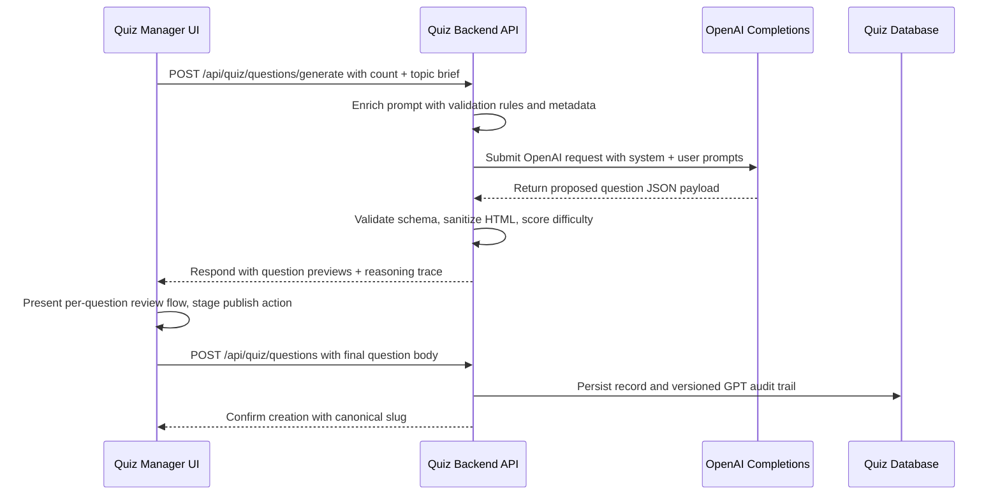

# GPT-Assisted Question Generation Flow

Quiz Manager lets content editors seed a topic description and rely on GPT to
produce draft questions. The application coordinates prompt assembly,
completion requests, and persistence so the generated question can be reviewed
and published safely.

The sequence below documents how the UI, quiz backend, OpenAI API, and quiz
database collaborate whenever an editor clicks **Generate question**.



## Operational Notes

- The backend enforces schema validation before surfacing GPT output so editors
  never see malformed payloads.
- Quiz Manager stores the final prompt, completion, and moderator overrides to
  maintain provenance for compliance reviews.
- Editors can request up to five drafts at a time. The UI tracks generation
  duration, provides a progress bar while reviewing the batch, and lets
  moderators step through each question sequentially.
- Editors can iteratively regenerate prompts; only the approved payload is
  persisted to the quiz database.

## Example Request

A minimal `curl` call mirrors what Quiz Manager emits when GPT drafting is
requested. Replace `OPENAI_API_KEY` with an environment-specific token.

```
curl -X POST \
  https://quiz.flashoffer.example/api/quiz/questions/generate \
  -H "Authorization: Bearer OPENAI_API_KEY" \
  -H "Content-Type: application/json" \
  -d '{
    "count": 3,
    "topic": "Spring espresso trivia",
    "target_audience": "baristas",
    "difficulty": "intermediate"
  }'
```
