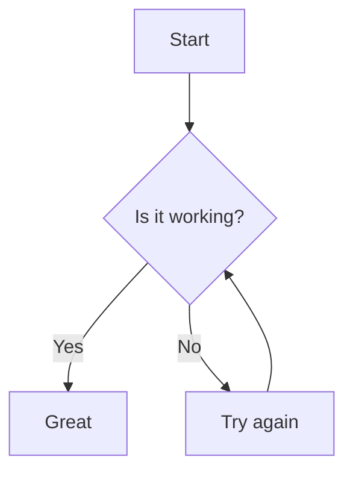
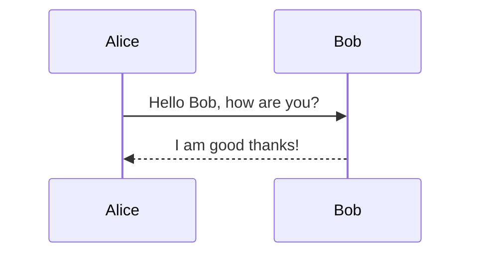

Mermaid converts text descriptions into diagrams. This example demonstrates
how to generate a diagram with Press.

Write your diagram in `diagram.mmd`:



Run `redo` to render the SVG:

```
redo diagram.svg
```

Include the image in your document:

```markdown

```

Mermaid supports many chart types. The snippet below shows a simple
sequence diagram:



Explore [Mermaid's docs](https://mermaid.js.org/) for more examples.
